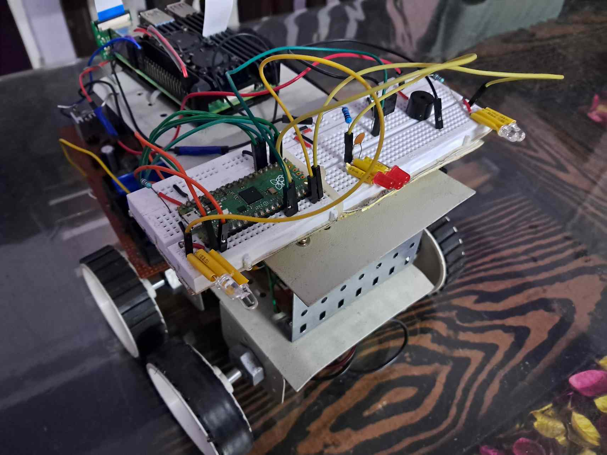
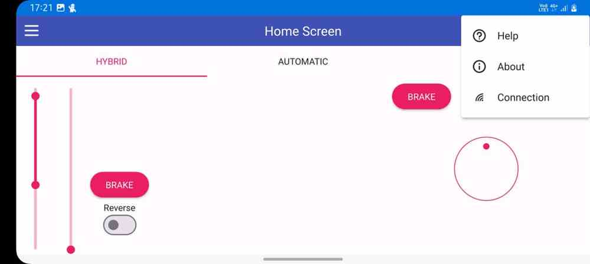
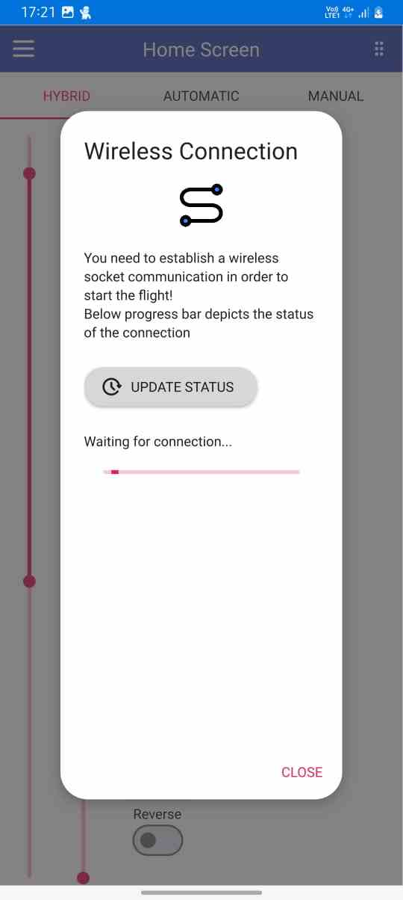
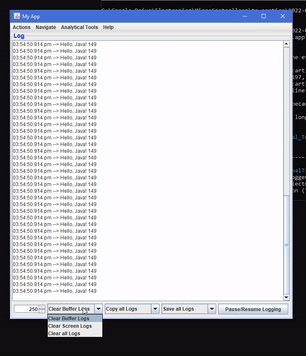
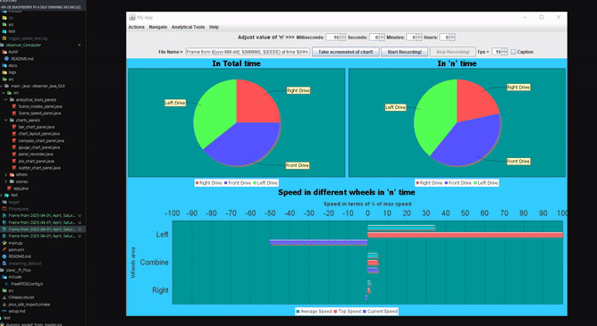
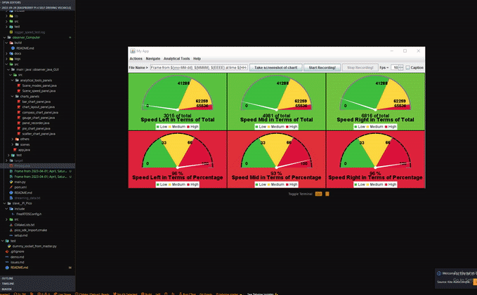
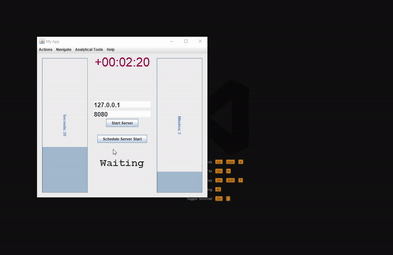
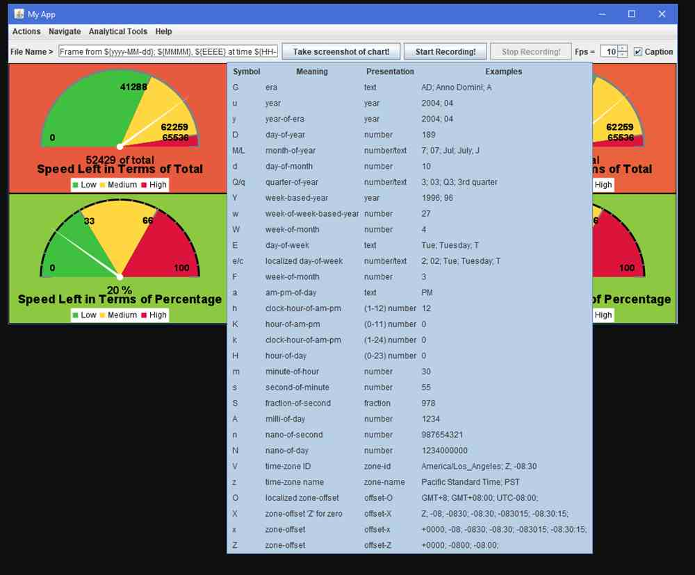
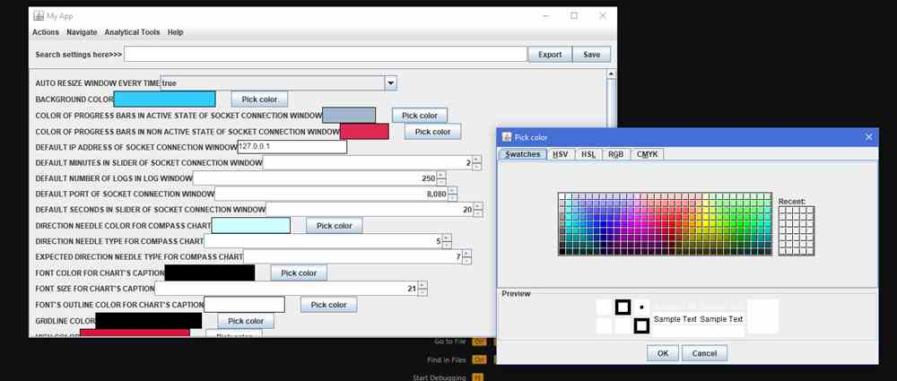

+++
title = "Raspberry Pi 4 Self-Driving Car"
date = "2019-01-01"
description = "This is a Self-Driving car (SDV) project which uses pi pico as a slave device and various sensor in order to work properly. "
tags = [
    "showcase",
    "software",
    "robotics",
]
categories = [
    "stpaul",
    "foss",
]
image = "20230122_092934.jpg"
[[links]]
title = "GitHub"
description = "Source code for the SDC"
website = "https://github.com/AmanRathoreP/Raspberry-Pi-4-Self-Driving-Vechicle"
image = "../../github-mark.svg"
image_dark = "../../github-mark-white.svg"
+++

## Features

- Stop signs detection
- Road lane following
- Turn Indicators
- Stop light(back side SDV)
- Stopping on any obstacle which is in front
- [Observer for *development stages*](#about-observer)
  - Live logs(of SDV or itself etc.)
  - Real-Time charts such as gauge chart, compass chart, scatter plot etc.
  - Interactive GUI
  - Fully customization with GUI
  - Scheduling the server for connection
  - Analyzing the data from previous run
  - and many more.....
- [User Display as a vehicle *dashboard*](#about-user-display)
  - Works on multiple platforms like Android, IOS, Windows, Linux, MacOs (ofcourse after compiling)
  - Real-Time interactions
  - Interactive GUI
  - Fully customization with GUI
  - Multiple driving modes
  - Communication via Sockets
  - and many more.....

> All features are highly customizable, and created while keeping scalability in mind

## Quick start

First setup pico-sdk c environment ...

### About the files
This information is is available on [project's github page](https://github.com/AmanRathoreP/Raspberry-Pi-4-Self-Driving-Vechicle/tree/master?tab=readme-ov-file#about-the-files).
### About Observer
Observer is a person which can use a desktop app in order to communicate with the SDV to see some live data of the SDV in order to really see what's happening in it. The application for the observer is developed purely in Java and been focused on analyzing data as much as possible to get some cool insights.
Previously the observer application was in python and it was a bare minimum software. However, current application is a GUI based application and have some cool analytical features like live logs, different types of charts such as bar chart, gauge chart, pie chart, etc. and many more. Some of it's images are provided [here](#observer-app).

### About User Display
This is kind of dashboard of a vehicle in reality we will have physical steering wheel, paddles etc. while driving but in order to test the SDV I had designed an interface in QT(C++). You can found images of the interface [here](#user-display-app).

## Demo

### SDC

### User Display App

> More graphics are available on the [project's github page](https://github.com/AmanRathoreP/Raspberry-Pi-4-Self-Driving-Vechicle/tree/master?tab=readme-ov-file#about-user-display).

### Observer App

> More graphics are available on the [project's github page](https://github.com/AmanRathoreP/Raspberry-Pi-4-Self-Driving-Vechicle/tree/master?tab=readme-ov-file#about-observer).

## Facts
- History
  - This is the 8th version of the vehicle. Previous versions are not tracked by any version control system.
  - It was initially started in 2019-20 as just an obstacle avoiding vehicle.
  - The idea of this project came years(2010-11) back while playing with a old school RC car.
- Development
  - The project got a kick start while I was working on another project related to a science competition.
  - Later I decided to showcase this same SDV at the competition.
  - The development of this particular version(from scratch) took about 50hrs. However the knowledge and research is of years of hardwork.
  - A similar vehicle was developed in order to test the hardware potential of the chassis. [Here is the GitHub repo of that project](https://github.com/AmanRathoreP/Bluetooth-wireless-car-with-various-features "Bluetooth-wireless-car-with-various-features"). However, the code base of both the projects are quite different.
